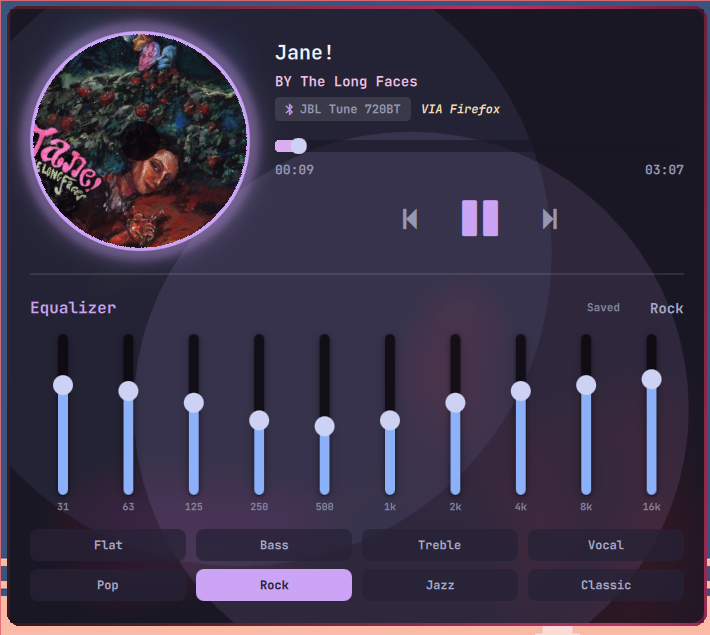
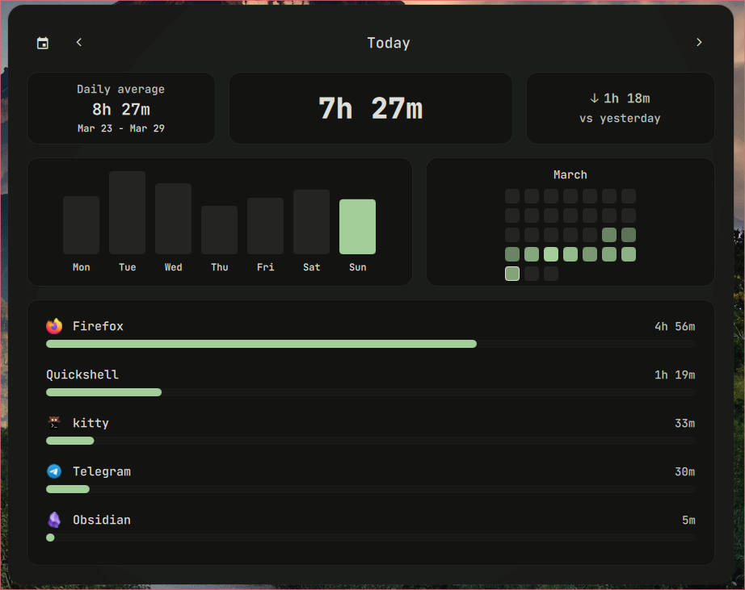
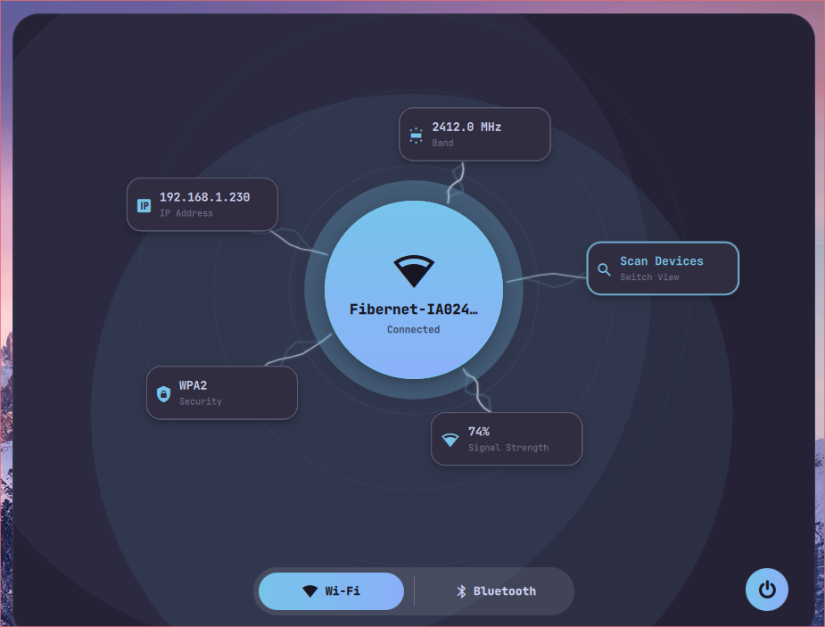
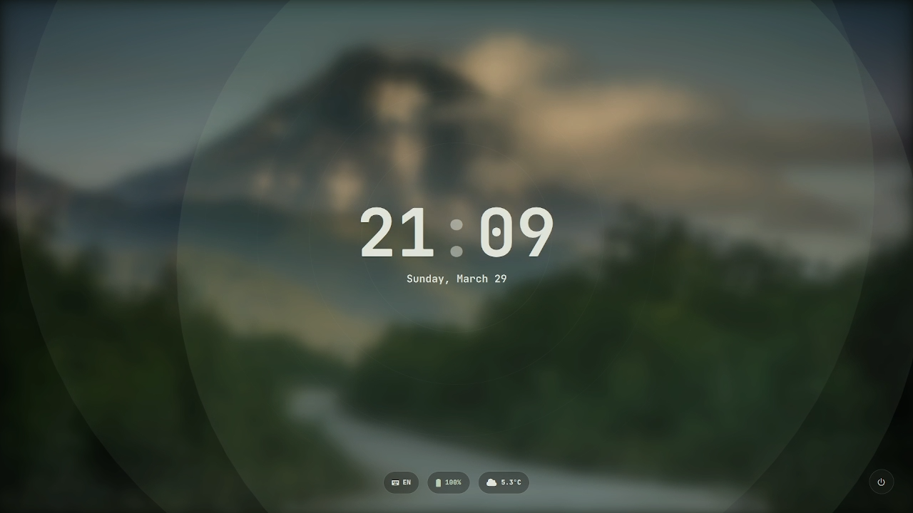

# ilyamiro NixOS Configuration

Персональная конфигурация NixOS 25.11 для ноутбука `ilyamiro` с Home Manager, Hyprland и кастомным Quickshell-интерфейсом. Проект собирает в одном репозитории системные настройки, пользовательские модули, динамическую тему через Matugen и набор скриптов для повседневной работы.

## ✨ Особенности

- Полная системная конфигурация NixOS с `configuration.nix`, `hardware-configuration.nix` и `home.nix`.
- Интеграция Home Manager с автоматическим импортом всех модулей из `config/programs`.
- Рабочая среда на базе GNOME + GDM с отдельной сессией Hyprland.
- Кастомный Quickshell UI: верхняя панель, экран блокировки и набор всплывающих виджетов.
- Динамическая цветовая схема через Matugen для Quickshell, Kitty, Firefox, Neovim, Rofi, SwayNC, SwayOSD, CAVA и Vesktop.
- Настроенные пользовательские приложения: Firefox, Kitty, Neovim, Rofi, Zsh, SwayNC, SwayOSD, CAVA.
- Скрипты для буфера обмена, скриншотов, переключения профилей питания, управления сетью, Bluetooth, аудио и обоями.
- Виджеты календаря, погоды, расписания, мониторинга батареи, музыки, громкости, сети и учёта времени в приложениях.
- Настройка гибридной графики AMD + NVIDIA PRIME offload и параметров производительности.

## 🚀 Быстрый старт

### 1. Что важно знать перед установкой

Конфигурация жёстко привязана к конкретной машине и пользователю. Перед применением нужно проверить и при необходимости изменить:

- имя пользователя `ilyamiro`
- домашний каталог `/home/ilyamiro`
- hostname `ilyamiro`
- timezone `Europe/Copenhagen`
- UUID разделов в `hardware-configuration.nix`
- monitor `eDP-1, 1920x1080@144`
- `nvidiaBusId` и `amdgpuBusId`
- пути вида `/etc/nixos/config/...`, которые используются в модулях и symlink-конфигурации
- профиль Firefox `zawmoi9h.default` и служебный профиль `schedule.special`
- параметры расписания в `config/sessions/hyprland/scripts/quickshell/calendar/schedule/get_schedule.py`

### 2. Разместить конфигурацию в правильном пути

Проект ожидает, что файлы лежат именно в `/etc/nixos`, потому что часть модулей и ресурсов ссылается на абсолютные пути внутри `/etc/nixos/config`.

```bash
sudo mkdir -p /etc/nixos
sudo cp -r config configuration.nix hardware-configuration.nix home.nix /etc/nixos/
```

### 3. Убедиться, что доступен Home Manager

В `configuration.nix` используется импорт `<home-manager/nixos>`, поэтому канал или соответствующая установка Home Manager должны быть доступны системе.

### 4. Применить конфигурацию

```bash
sudo nixos-rebuild switch
```

### 5. Войти в Hyprland

После сборки можно выбрать сессию Hyprland через GDM. При старте автоматически запускаются:

- `swww-daemon`
- `hypridle`
- `playerctld`
- watchers для `cliphist`
- `easyeffects`
- `volume_listener.sh`
- Quickshell-панель `TopBar.qml`
- основной контейнер виджетов `Main.qml`
- демон Focus Time

## 📁 Структура проекта

```text
.
├─ configuration.nix              # Системная конфигурация NixOS
├─ hardware-configuration.nix     # Аппаратная конфигурация, файловые системы и платформа
├─ home.nix                       # Пользовательская конфигурация Home Manager
└─ config
   ├─ fonts                       # Локальные шрифты, подключаемые через Home Manager
   ├─ programs                    # Модули приложений и пользовательских конфигов
   │  ├─ cava
   │  ├─ firefox
   │  ├─ kitty
   │  ├─ matugen
   │  ├─ neovim
   │  ├─ plymouth
   │  ├─ rofi
   │  ├─ swaync
   │  ├─ swayosd
   │  └─ zsh
   └─ sessions
      └─ hyprland
         ├─ *.nix                 # Модули Hyprland: бинды, автозапуск, idle, мониторы, анимации
         └─ scripts
            ├─ *.sh               # Системные и вспомогательные shell-скрипты
            └─ quickshell         # QML-интерфейс, Python-утилиты и логика виджетов
```

## 🛠 Использование

После входа в Hyprland проект предоставляет готовую рабочую среду с панелью, виджетами и горячими клавишами.

### Основные горячие клавиши

- `Super + D` — запуск `rofi` в режиме приложений
- `Alt + Tab` — переключатель окон через `rofi`
- `Super + C` — история буфера обмена через `cliphist`
- `Super + A` — центр уведомлений `swaync`
- `Super + L` — экран блокировки Quickshell
- `Print` — скриншот области
- `Shift + Print` — скриншот области с редактором `satty`
- `Super + Return` — терминал Kitty
- `Super + 1..0` — переключение рабочих пространств
- `Super + Shift + 1..0` — перенос окна на рабочее пространство

### Quickshell-виджеты

- `Super + Q` — музыкальный виджет с плеером и эквалайзером EasyEffects
- `Super + V` — управление устройствами ввода/вывода и громкостью
- `Super + N` — сеть и Bluetooth
- `Super + S` — календарь, погода, дневник и расписание
- `Super + W` — выбор локальных и найденных через DuckDuckGo обоев
- `Super + B` — батарея и системная информация
- `Super + M` — мониторные настройки
- `Super + Shift + T` — статистика Focus Time
- `Super + Shift + S` — виджет `stewart`
- `Super + H` — экран-подсказка с управлением

### Динамическая тема

Matugen генерирует палитру и раскладывает её по шаблонам. В проекте настроен вывод в:

- `/tmp/qs_colors.json` для Quickshell
- `/tmp/kitty-matugen-colors.conf` для Kitty
- `~/.config/nvim/matugen_colors.lua` для Neovim
- `~/.config/cava/colors` для CAVA
- `~/.config/rofi/theme.rasi` для Rofi
- `~/.config/swaync/style.css` для SwayNC
- `~/.config/swayosd/style.css` для SwayOSD
- `~/.mozilla/firefox/.../matugen*.css` для Firefox
- `~/.config/vesktop/themes/matugen.theme.css` для Vesktop

### Дополнительные сценарии

- `qcopy` в Zsh собирает содержимое выбранных файлов и копирует его в Wayland clipboard.
- `fetch` генерирует цветной конфиг для `fastfetch` на основе текущей палитры Quickshell.
- `qs_manager.sh` управляет открытием, фокусом и закрытием всех всплывающих окон Quickshell.
- `screenshot.sh` сохраняет снимки в `~/Images/Screenshots`.
- `weather.sh` работает с OpenWeather и кеширует данные в `~/.cache/quickshell/weather`.
- `focus_daemon.py` записывает активность приложений в SQLite-базу `~/.local/share/focustime/focustime.db`.

## 🧪 Технологии

- NixOS
- Nix
- Home Manager
- Hyprland
- Quickshell
- QML
- Bash
- Python
- Selenium
- Matugen
- Firefox
- Kitty
- Neovim
- Rofi
- SwayNC
- SwayOSD
- CAVA
- PipeWire
- EasyEffects
- GNOME
- GDM








